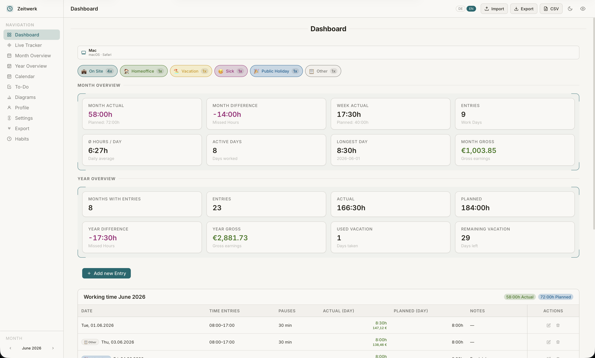

<div align="center">

# ⏱ Zeitwerk

<br>



<br>
<br>

**A modern, privacy-first time tracking web app - built entirely in your browser.**

Track your workdays. Visualize your time. Build better habits. Export everything. No backend, no account, no cloud.

<br>

[](https://zeitwerk-iota.vercel.app)

<br>

    

[What is Zeitwerk?](#what-is-zeitwerk) • [Quick Start](#quick-start) • [Feature Overview](#feature-overview) • [Architecture](#architecture) • [Tech Stack](#tech-stack) • [UI / UX Highlights](#ui--ux-highlights) • [Key Components at a Glance](#key-components-at-a-glance) • [Author](#author) • [License](#license)

</div>

<br>

---

## What is Zeitwerk?

Zeitwerk is a **fully client-side time tracking web app** with zero dependencies on external servers or accounts. Everything lives in your browser - your data stays yours.

It combines a dashboard with powerful features that usually come as separate tools: time tracking, calendar, habits, charts, todos, and multi-format exports - all in one place, installable as a (offline) PWA.

<br>

---

## Quick Start

```bash
git clone https://github.com/beri336/zeitwerk
cd zeitwerk
npm install
npm run dev
```

Open the shown `localhost` URL in your browser. That's it - no `.env`, no backend, no API keys.

```bash
npm run build            # Production build
npm run preview          # Preview the production build
npm run dev -- --host    # Access from other devices on your network (e.g. iPhone)
```

<br>

---

## Feature Overview

<table>
<tr>
<td width="50%" valign="top">

**Core Tracking**

- Live Start/Stop with automatic break detection
- Month & Year calendar overviews
- Inline editing directly in the calendar grid
- Daily progress bars and absence indicators

**Insights**

- 9 interactive ECharts-based diagrams
- Weekly balance, overtime, earnings, heatmaps, and more
- Configurable time ranges and chart exports

**Productivity**

- Full appointment calendar with reminders & tags
- To-Do list with subtasks, priorities, and due dates
- Habit tracker with streaks and weekly/monthly heatmaps

</td>
<td width="50%" valign="top">

**Exports**

- CSV, JSON, PDF and clipboard export
- Configurable scope and date range
- JSON import/export for full data portability

**Personalization**

- Profile with salary, overtime settings, and defaults
- Privacy mode - mask all monetary values instantly
- Full German 🇩🇪 and English 🇬🇧 support (real-time switch)
- Dark / Light theme with system-aware default

**PWA**

- Installable on desktop and mobile
- Offline-capable with Workbox service worker
- Automatic update banner when a new version is available

</td>
</tr>
</table>

<br>

---

## Architecture

```
src/
├── assets/             # Global CSS, fonts
│   ├── charts/         # 9 ECharts-based chart components
│   ├── features/       # One card component per view (DashboardCard, HabitTrackerCard, …)
├── components/
│   ├── layout/         # AppSidebar, AppTopbar, AppBottomNav
│   └── ui/             # Reusable UI primitives (KpiCard, ToastList, DeviceChip, …)
├── composables/        # Business logic hooks (useTime, useExport, useHolidays, …)
├── locales/            # i18n translation files (de.json, en.json)
├── router/             # vue-router route definitions
├── stores/             # Pinia stores (zeitwerk.js, notificationStore.js)
├── views/              # One view per route, composes feature cards
├── i18n.js
└── main.js
```

**Data Flow**

```
localStorage
    └── useZeitwerkStore (Pinia)
            ├── Views          → computed: monthActual, weekGroups, …
            ├── EntryModal     → write: add / edit / delete entries
            └── Composables    → useExport, useHolidays, useAbsence, …
```

All data is stored in `localStorage`. No server communication ever occurs. All data is yours. Privacy first.

<br>

---

## Tech Stack

| Layer       | Technology                           |
| ----------- | ------------------------------------ |
| Framework   | Vue 3 - `<script setup>` SFCs        |
| Build Tool  | Vite                                 |
| Routing     | Vue Router                           |
| State       | Pinia                                |
| Charts      | Apache ECharts via `vue-echarts`      |
| i18n        | `vue-i18n`                           |
| PWA         | `vite-plugin-pwa` + Workbox          |
| Styling     | CSS custom properties (no framework) |
| Persistence | `localStorage` - no backend needed   |

<br>

---

## UI / UX Highlights

- **Design System**: CSS custom properties for colors and spacing - consistent across dark and light mode
- **Responsive Layout**: Sidebar on desktop, bottom navigation + drawer on mobile, safe-area support for notched devices
- **Privacy Mode**: All salary and earnings data can be masked globally in one click
- **Touch-Optimized**: Touch targets, no iOS tap flash, 16px input font size to prevent zoom

<br>

---

## Key Components at a Glance

<details>
<summary><strong>Views & Feature Cards</strong></summary>
<br>

| Component           | Description                                  |
| ------------------- | -------------------------------------------- |
| `DashboardView`     | KPIs, device info, quick actions             |
| `LiveTrackingView`  | Start/stop workday, break tracking           |
| `MonthOverviewView` | Calendar grid + table with inline editing    |
| `YearOverviewView`  | 12 monthly mini-calendars                    |
| `CalendarView`      | Appointment calendar with agenda mode        |
| `ToDoView`          | Tasks with subtasks, filters, priorities     |
| `DiagramsView`      | All 9 analytics charts                       |
| `HabitTrackerView`  | Habit streaks and heatmaps                   |
| `ExportView`        | CSV / JSON / PDF / clipboard export          |
| `SettingsView`      | Defaults, salary, notifications, danger zone |

</details>

<details>
<summary><strong>Charts</strong></summary>
<br>

| Chart                     | What it shows                     |
| ------------------------- | --------------------------------- |
| `WeekBarChart`            | Actual vs. planned hours per week |
| `RunningBalanceChart`     | Cumulative overtime over time     |
| `DayDistributionChart`    | Average hours by weekday          |
| `DayLengthHistogramChart` | Distribution of workday lengths   |
| `AbsenceBreakdownChart`   | Breakdown by absence type         |
| `MonthOverviewChart`      | Monthly actual/planned comparison |
| `MonthComparisonChart`    | 6-month side-by-side comparison   |
| `YearlyOvertimeChart`     | Full-year overtime balance        |
| `YearlyGrossChart`        | Full-year gross earnings          |

</details>

<details>
<summary><strong>Stores & Composables</strong></summary>
<br>

| File                              | Purpose                                     |
| --------------------------------- | ------------------------------------------- |
| `stores/zeitwerk.js`              | Main store: entries, settings, calculations |
| `stores/notificationStore.js`     | Notification preferences and status         |
| `composables/useTime.js`          | Date/time helpers and formatting            |
| `composables/useAbsence.js`       | Absence types and helpers                   |
| `composables/useHolidays.js`      | Public holiday lookup by state              |
| `composables/useExport.js`        | JSON/CSV export and import logic            |
| `composables/useHabitStore.js`    | Habit tracking state and persistence        |
| `composables/useTodoStore.js`     | To-do list state and filters                |
| `composables/useNotifications.js` | Browser Notification API                    |
| `composables/useToast.js`         | Toast creation and lifecycle                |
| `composables/useProfileStore.js`  | Profile data and persistence                |

</details>

<br>

---

<div align="center">

## Author

[](https://github.com/beri336) [](https://bitbucket.org/berkants/workspace/projects/DEV)

<br>

## License

This project is licensed under the **MIT License** - see [`docs/LICENSE`](docs/LICENSE) for details.

<br>

---

_Made with Vue 3 · Runs entirely in your browser · No account required_

[⬆ Back to Top](#-zeitwerk)

</div>